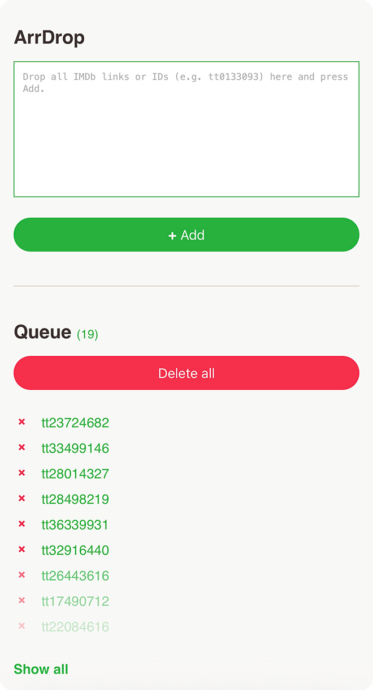

# ArrDrop

ArrDrop is a tiny two-part tool that lets you drop IMDb links/IDs into a simple web page and have them show up in Radarr. This lets you add movies to Radarr even when your home media server is offline and also without exposing it directly to the internet. ArrDrop can be self-hosted and it's free.

Project: https://github.com/The-Error/ArrDrop
Version: 2026.02.12

##  What it does
- PHP client: lets you paste IMDb IDs into a web page.
- Backend sync: reads the list and adds movies to Radarr.

So the frontend acts like a simple queue, and the backend script pulls this list of IMDb IDs when it runs and adds them to Radarr automatically.

##  Structure
- `arrdrop-client/` → PHP client (web server)
- `arrdrop-backend/` → Python sync (backend)

##  Requirements
- PHP 7+ (client)
- Python 3.9+ (backend)
- Radarr v3 with API access

##  Quick start
1. Upload `arrdrop-client/index.php` to your web server.
2. Set basic file permissions:
   - `movies.txt` → web server can read it (`0644`)
   - ArrDrop folder → web server can read and open it (`0755`)
   - `index.php` → web server can read it (`0644`)
3. On the machine that can reach Radarr, download the backend (`arrdrop-sync.py`) and run setup once:
   - `python3 arrdrop-sync.py --setup`
4. Follow the wizard prompts and enter:
   - ArrDrop list URL
   - Radarr URL
   - Radarr API key
   - Root folder
   - Quality profile
5. Start your first sync:
   - `python3 arrdrop-sync.py`

If you don't want to self-host ArrDrop, use the official ArrDrop website instead. It's free and anonymous. Just create a list, paste it into your backend, and you're ready to go:
- https://the-error.net/

##  Website & Documentation
- FAQ: https://the-error.net/faq.php
- About: https://the-error.net/about.php

##  Usage
- Add IDs in the web UI (any format; it extracts valid IDs).
- Run the backend to sync into Radarr.
- Use `--dry-run` to test without adding.
- Use `--log` to show movies added in the last sync.

##  Theme (day/night)
The client supports a built-in day/night theme without any UI toggle.  
Edit `arrdrop-client/index.php` and set:
- `$night_mode = true;` for night mode
- `$night_mode = false;` for day mode

You can also override it in the URL:
- `?theme=night`
- `?theme=day`

##  Files created by the frontend and backend
- `movies.txt` → current IDs in your Queue
- `processed.txt` → IDs already added
- `arrdrop.log` → sync log

##  License
MIT (see license file for details)

##  Author
Zoran Karavla
